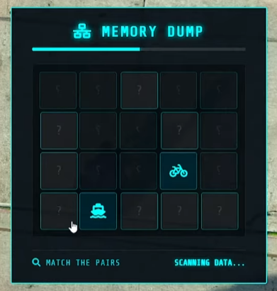
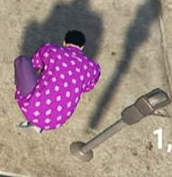

# 🅿️ SSRP Parking Meter Robbery (`ppr-meterrobbery`)

SSRP Parking Meter Robbery is a premium, lightweight, and highly interactive FiveM heist resource designed for **QBCore** servers. It features a stunning, custom-built cyberpunk-themed NUI hacking minigame (Pair-Matching Memory Game) that players must solve to steal the parking meter's contents.

It comes equipped with built-in entity targeting, flexible reward schemes, police dispatch alerts, tool breakage mechanics, and localized cooldowns to prevent spamming.

---

## 📷 Preview


---

## ✨ Features

- **🎮 Cyberpunk Memory Minigame**: A modern, responsive, neon-themed memory match UI where players must find matching icon pairs within a time limit.
- **🎯 `qb-target` Integration**: Zero-lag entity interaction with standard parking meter props (`prop_parknmeter_01` & `prop_parknmeter_02`).
- **🔧 Multi-Tool Support**: Use a standard `lockpick` or a higher-tier `toolset` (can be toggled in config).
- **📈 Scalable Difficulty**: Configure different grid sizes (e.g., 4x5 for lockpick, 5x6 for toolset), time limits, and icon pools for each tool to change the hack difficulty.
- **🚨 Dispatch Integrations**:
  - Automatically sends server-side dispatch alerts to **`kartik-mdt`**.
  - Triggers client-side custom alerts using **`ps-dispatch`** on failure.
- **💰 Customizable Rewards**: Configure payouts to give Cash, Items, or Both. Easy item drop rates and ranges can be specified in the config.
- **⏲️ Local Cooldowns**: Cooldowns are applied individually per parking meter based on coordinates, allowing other meters in the city to be robbed while one is rebooting.
- **💥 Tool Break Chance**: Chance-based tool loss upon failing the hack, adding a risk/reward factor to robberies.

---

## 📦 Dependencies

This resource requires the following to be installed on your server:

- **[qb-core](https://github.com/qbcore-framework/qb-core)** (Core framework)
- **[qb-target](https://github.com/qbcore-framework/qb-target)** (For interacting with parking meters)
- **[ps-dispatch](https://github.com/Project-Sloth/ps-dispatch)** (Optional - client-side alert export on hack fail)
- **`kartik-mdt`** (Optional - server-side dispatch event)

---

## ⚙️ Installation

### 1. File Placement
Drag and drop the `ppr-meterrobbery` folder into your server's `resources` directory (e.g., `[standalone]` or `[ppr]`). Make sure the folder is named **`ppr-meterrobbery`**.

### 2. Configure items in QBCore Shared
Ensure the following items exist in your `qb-core/shared/items.lua` (if they are not already present):

```lua
-- Standard lockpick (Usually already exists in QBCore)
['lockpick'] = { 
    ['name'] = 'lockpick', 
    ['label'] = 'Lockpick', 
    ['weight'] = 250, 
    ['type'] = 'item', 
    ['image'] = 'lockpick.png', 
    ['unique'] = false, 
    ['useable'] = false, 
    ['shouldClose'] = true, 
    ['combinable'] = nil, 
    ['description'] = 'Useful for picking locks.' 
},

-- Toolset (Required if Config.EnableToolset is set to true)
['toolset'] = { 
    ['name'] = 'toolset', 
    ['label'] = 'Toolset', 
    ['weight'] = 1000, 
    ['type'] = 'item', 
    ['image'] = 'toolset.png', 
    ['unique'] = false, 
    ['useable'] = false, 
    ['shouldClose'] = true, 
    ['combinable'] = nil, 
    ['description'] = 'A professional set of tools for bypass attempts.' 
},
```
Make sure to add the corresponding `lockpick.png` and `toolset.png` images to your inventory resource images directory (e.g., `qb-inventory/html/images/`).

### 3. Server Config
Add the following line to your `server.cfg`:
```cfg
ensure ppr-meterrobbery
```

---

## 🛠️ Configuration

You can customize the script behavior by editing [config.lua](file:///c:/Users/pratheek/Downloads/ppr-scripts/ppr/ppr-meterrobbery/config.lua):

| Config Field | Default | Description |
| :--- | :---: | :--- |
| `Config.EnableToolset` | `true` | Enables/disables the professional `toolset` item for robbing meters. |
| `Config.ToolBreakChance` | `10` | The percent chance (0-100) that a player's tool breaks on a failed hack. |
| `Config.RewardType` | `'both'` | The reward type: `'money'`, `'item'`, or `'both'`. |
| `Config.MoneyReward` | `300` - `600` | The minimum and maximum cash rewarded on a successful robbery. |
| `Config.ItemRewards` | Steel & Plastic | Items given as rewards with customizable amounts and percentage drop chances. |
| `Config.MeterCooldown` | `300` | Cooldown time (in seconds) for a robbed meter before it can be hit again (5 mins default). |
| `Config.PoliceCallChance` | `60` | The percent chance that dispatch will be notified when a robbery begins. |
| `Config.HackSettings` | Grid, Time, Icons | Custom grid sizes, timers, and icon sets for `lockpick` and `toolset` difficulty tuning. |
| `Config.MeterModels` | prop_parknmeter_01, prop_parknmeter_02 | Parking meter entity prop models targeted for robbery. |

---

## 👨‍💻 Author & Credits
- Created by **Pratheek**
- UI Design: Modern share tech mono cyberpunk UI
- Feel free to modify the source code to fit your roleplay environment needs!
